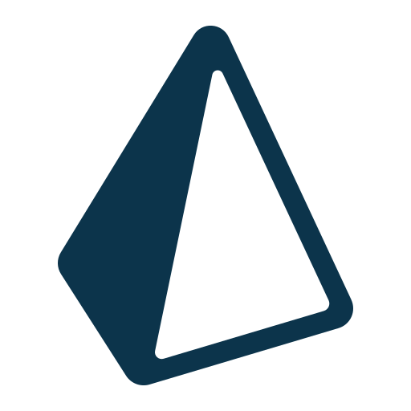

<h1 align="left" id="macropower-title">:wave: Hi everyone! I'm Randy Buhendwa</h1>
<h3 align="left">I am an enthusiastic and curious web and mobile developer. As much as I like to learn new things, in order to meet new challenges, I also like to meet new people, because every meeting teaches.</h3>

&nbsp;&nbsp;&nbsp;&nbsp;
&nbsp;&nbsp;&nbsp;&nbsp;
&nbsp;&nbsp;&nbsp;&nbsp;

 :office: &nbsp;I'm currently working at **Koumi Shop**   
 :seedling: &nbsp;I’m currently learning **Cloud DevOps Engineering** and **Flutter**  
 :speech_balloon: &nbsp;I like to talk about **Software Engineering** , **Books** and **Cultural exchange**  
 :mailbox: &nbsp;Contact me on <b><a href="mailto: randy.buhendwa@gmail.com">randy.buhendwa@gmail.com</a></b> 

 

<h2 align="left" id="macropower-tech">Favorite Tech</h2>

> OS that I like to work with.
<table>
  <tr>
    <td align="center" width="96">
      
       Ubuntu
    </td>
    <td align="center" width="96">
      
       Windows
    </td>
  </tr>
</table>

> Tools that I like to work with.

> Languages & Frameworks that I like to work with.
<table>
  <tr>
    <td align="center" width="96">
      
       HTML
    </td>
    <td align="center" width="96">
      
       CSS
    </td>
    <td align="center" width="96">
      
       JavaScript
    </td>      
  </tr>

  <tr>
    <td align="center" width="96">
      
       React
    </td>
    <td align="center" width="96">
      
       Next
    </td>
    <td align="center" width="96">
      
       Redux
    </td>      
    <td align="center" width="96">
      
       Sass
    </td>
    <td align="center" width="96">
      
       Tailwind
    </td>
    <td align="center" width="96">
      
       Bootstrap
    </td>      
  </tr>  

  <tr>
    <td align="center" width="96">
      
       Express
    </td>
    <td align="center" width="96">
      
       Nest
    </td>
    <td align="center" width="96">
      
       Firebase
    </td>      
    <td align="center" width="96">
      
       Sequelize
    </td>
    <td align="center" width="96">
      
       Prisma
    </td>     
  </tr>
  <tr>
    <td align="center" width="96">
      
       Flutter
    </td>  
  </tr>  
</table>

<h2 align="left">Coding Activity</h2>
